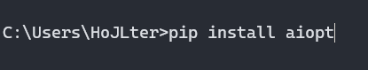

<h1 align="center">
    AIOproxytest
</h1>

<div align="center">
    
</div>

<h3 align="center">
    aiopt is a simple asynchronous lib for testing proxy servers
</h3>

---
<h2>
   🖥 Installation 
</h2>

<div>
    To install aiopt you may use pip:
    
</div>


<h2>
   💡 Usage
</h2>
Example:

```Python
import asyncio
from aiopt import check_proxies


async def main():
    proxy_list = ['https://190.58.248.86:80',
                  'http://45.12.150.82:8080']

    result = await check_proxies(proxy_list=proxy_list,
                                 url="https://httpbin.org")

    print(result) # [(False, 'https://190.58.248.86:80'),(True, 'http://45.12.150.82:8080')]


if __name__ == '__main__':
    asyncio.run(main())
```

<h2>
   🤝 Contribution 
</h2>

<div>
    Contributions are welcome!
    If you have ideas for improving this project, please post them in issues.
    (if I don't answer, you can email me)
</div>

---

<h3 align="center">
    If you have any troubles, please tell about it in issues
</h3>

